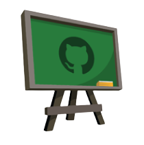

# CS424: 프로그램 논증 [🇰🇷](README.md)[🇬🇧](README.en.md)

## 수업정보
- 교수: 허기홍 [🏠](https://kihongheo.kaist.ac.kr) [📧](kihong.heo@prosys.kaist.ac.kr)
- 조교 [📧](cs424.ta@prosys.kaist.ac.kr)
  - 장수진 [🏠](https://sujin0529.github.io)
  - 장봉준 [🏠](https://bongjunj.github.io)
- 강의 시간: 월/수 Mon/Wed 09:00 - 10:15
- 면담 시간(사전 약속 필요):
  - 교수: Mon 10:15 - 11:00
  - 조교: Mon 10:15 - 11:00
- 강의실: N1 102

## 강의 소개 
> 내가 원하는 프로그램을 자동으로 만들 수 있는가? 그리고 그 프로그램이 내가 원하는 것임을 자동으로 증명할 수 있는가?

본 강의의 핵심 주제는 안전하고 믿을만한 소프트웨어를 만들기 위한 "명세와 구현 사이의 관계"이다.
크게 아래와 같은 두 가지 세부 주제를 다룬다:
1. **프로그램 검증(program verification)**: 주어진 구현이 해당 명세를 만족하는지 어떻게 _자동으로 증명할_ 것인가?
2. **프로그램 합성(program synthesis)**: 주어진 명세를 만족하는 구현을 어떻게 _자동으로 만들어낼_ 것인가?

학생들은 강의와 숙제를 통해 프로그램 검증과 합성의 이론과 실제를 배울 것이다.
그리고 나아가 논리와 직관을 모두 갖춘 진정한 종합 인공지능이 실현되는 미래를 함께 그리게 될 것이다.

본 강의에서는 [쉬운전문용어](https://easyword.kr)를 사용하여 [소박하게 지식을 전달한다](https://prosys.kaist.ac.kr/easy-word/).

## 성적
#### 반영 비율
- 숙제: 30%
- 기말고사: 50%
- 참여: 20%
  - 적극적인 참여로 본인이 배운 바를 [스스로 다채롭게 내뿜는](hof.md) 학생들을 위한 보상입니다.
  - 매 수업 시간에 항상 여러분을 만날 수 있기를 기대합니다. [출석은 정량평가하지 않습니다](https://prosys.kaist.ac.kr/attendance/). 정량화할 만큼 가치가 낮지 않기 때문입니다.

#### 평가 기준
- 절대 평가: A >= 70, B >= 50, C >= 30, D >= 20, F < 20

## P/NR 관련 공지
이 강의는 P/NR 성적을 허용하지 않습니다.
신입생은 반드시 교수에게 이메일을 통해 사전 승인을 받은 후 수강신청하길 바랍니다.

## 교재
- 강의자료가 제공됩니다.
- [Program Synthesis](https://www.microsoft.com/en-us/research/wp-content/uploads/2017/10/program_synthesis_now.pdf) (PS)
- [Introduction to Program Synthesis](https://people.csail.mit.edu/asolar/SynthesisCourse/index.htm) (IPS)
- [The Calculus of Computation](https://www.amazon.com/Calculus-Computation-Procedures-Applications-Verification/dp/3540741127) (COC)

## 몰입을 위한 약속
모두가 몰입하는 강의를 위해 모든 전자기기(노트북, 태블릿, 핸드폰)는 책상위에 올려놓지 않기로 합시다.
수업 중 전자기기를 사용하는 것이 끼치는 악영향은 이미 널리 알려져 있습니다([1](https://www.sciencedirect.com/science/article/pii/S0360131512002254?via%3Dihub),[2](https://www.nytimes.com/2025/08/21/opinion/mobile-phones-college-classrooms.html)).
본인의 주의를 산만하게 할 뿐만 아니라 주변 사람들이 수업에 집중하는데도 큰 방해가 됩니다.
모두가 각자 따로 모니터를 보기 보다는 함께 같은 곳을 보며 왁자지껄 난상토론하는 수업이 되길 바랍니다.
필요한 자료는 이 저장소에 있으니 원한다면 미리 인쇄를 해서 오세요.

자세한 이야기는 [기사](https://prosys.kaist.ac.kr/engagement/)를 참고하세요.

## 숙제
이 강의에서 학생들은 다양한 프로그래밍 숙제를 통해 프로그램 검증기와 합성기를 설계하고 구현하는 법을 배웁니다.
특히 [여기](TOOL.md)에 있는 몇 가지 도구를 사용할 예정입니다.

프로그램 검증기 채점을 위한 프로그램은 [BugSynth](https://prosys.kaist.ac.kr/bugsynth/)를 이용하여 자동으로 생성됩니다.
BugSynth는 LLM과 프로그램 검증 기술을 활용하여 자연스럽고 믿을만한 채점용 오류 프로그램을 생성하는 도구입니다.

모든 숙제 제출은 Github와 Gradescope 를 통해서 이루어집니다.
매 숙제마다 제출을 위한 GitHub Classroom 초대 URL이 [게시판](https://github.com/prosyslab-classroom/cs424-program-reasoning/discussions)에 공지됩니다.
초대를 수락하면, 여러분의 숙제를 위한 비공개 개인 저장소가 만들어 질 것입니다.
여러분은 제출 기한 이전에 원하는 만큼 해당 저장소에 제출할 수 있고,
이 저장소를 Gradescope에 제출하여 채점결과를 확인할 수 있습니다.

기한을 넘겨서 제출할 시 아래와 같은 규정에 따라 채점합니다:
- 하루 늦을 시 점수의 80%
- 이틀 늦을 시 점수의 50%
- 사흘 이상 늦을 시 0%

## 학문 윤리
학문 윤리를 어긴 수강생은 F를 받습니다. 자세한 사항은 [KAIST 전산학부 명예규정](https://cs.kaist.ac.kr/content?menu=309)을 참고하십시오.

세상에 널린 자료(예: 구글 검색, ChatGPT)를 자신의 창작물인 것처럼 제출하는 것은 학문 윤리에 어긋납니다.
본 과목의 모든 과제는 본인의 능력으로 하는 것이 원칙입니다.
제출한 과제는 기존 저작물(다른 수강생, 과거 수강생, AI 생성물 등)과 자동으로 비교하여 비슷한 경우 표절로 판단합니다.
이는 학계의 오래된 원칙이며 인터넷 검색이나 AI 도구가 등장했다고 해서 달라진 것은 없습니다.

AI 도구는 여러분의 수고를 덜어주지만, 깊은 사고력을 길러주지는 못합니다.
여러 실험에서([1](https://cacm.acm.org/news/the-impact-of-ai-on-computer-science-education/),
[2](https://product.kyobobook.co.kr/detail/S000000600543)
[3](https://www.washingtonpost.com/technology/2026/07/07/how-stop-chatgpt-ruining-how-you-think/))
에서 반복해서 이야기하고 있지요.
AI 모델 종류와 상관없이 [비슷한 질문에는 비슷하게 평범한 답](https://arxiv.org/pdf/2510.22954)을 내는 경우가 많기도 하고요.
여러분의 소중한 학습 기회를 쉽게 버리지 마시길 바랍니다.

## 강의 계획
|주|주제|읽기|숙제|
|-|------|-------|--------|
|0|[Functional Programming in OCaml](slides/lecture0.pdf)||HW0: Hello-world, OCaml Programming, Automated Theorem Proving|
|1|[Introduction](slides/lecture1.pdf)| Undecidability  |||
|2|[Operational Semantics](slides/lecture2.pdf)||HW1: SmaLLVM Interpreter|
|3|[Concepts in Program Verification](slides/lecture3.pdf)||HW2: Verification-aware Programming|
|4|[Propositional Logic](slides/lecture4.pdf)|COC Ch1,  [Curry-Howard Correspondence](https://cs3110.github.io/textbook/chapters/adv/curry-howard.html)|
|5|[First-order Logic](slides/lecture5.pdf)|COC Ch2|
|6|[First-order Theory](slides/lecture6.pdf)|COC Ch3||
|7|[Hoare Logic](slides/lecture7.pdf)|COC Ch5, [CACM'21](https://cacm.acm.org/magazines/2021/7/253452-formal-software-verification-measures-up/fulltext)|HW3: Mini-Dafny|
|8|[Automated Program Verification](slides/lecture8.pdf)||HW4: SmaLLVM Verifier|
|9|[Overview of Program Synthesis](slides/lecture9.pdf)|PS Ch1-2, IPS Lec1, [Wired](https://www.wired.com/story/ai-write-code-like-humans-bugs/), [IEEE Spectrum](https://spectrum.ieee.org/ai-code-generation-language-models), [CACM](https://cacm.acm.org/magazines/2022/10/264844-neurosymbolic-ai/fulltext)||
|10|[Inductive Synthesis and Enumerative Search](slides/lecture10.pdf)|PS Ch4.1, IPS Lec2-4|HW5: LIA Synthesizer|
|11|[Search Space Pruning](slides/lecture11.pdf)|||
|12|[Search Space Prioritization](slides/lecture12.pdf)|[CACM'18](https://cacm.acm.org/magazines/2018/12/232879-search-based-program-synthesis/fulltext)||
|13|[Representation-based Search](slides/lecture13.pdf)||HW6: SLIA Synthesizer|
|14|[Constraint-based Search](slides/lecture14.pdf)|||
|15|[Functional Synthesis](slides/lecture15.pdf)||HW7: CEGIS|
|16|[Neuro-Symbolic AI](slides/lecture16.pdf)|[Trustworthy AI](https://prosys.kaist.ac.kr/trustworthy/)|HW8: AI-based Program Synthesis|
|-|Final Exam|||

## 명예의 전당
지난 학기 수강생들이 [남긴](https://prosys.kaist.ac.kr/what-is-left/) 멋진 작품을 [여기서](hof.md) 감상해 보세요 (에세이, 그림 등).

## 관련 강의
- [CS402: 전산논리학 개론](https://github.com/hongseok-yang/logic23), KAIST
- [CS524: 프로그램 분석](https://github.com/prosyslab-classroom/cs524-program-analysis), KAIST

## 감사
이 강의의 자료는 아래 강의의 자료를 참고하여 작성하였습니다.

- [CS389: Automated Logical Reasoning](https://www.cs.utexas.edu/~isil/cs389L/), Univ. of Texas at Austin
- AAA528: Computational Logic, Korea Univ.
- [CSE291: Program Synthesis](https://github.com/nadia-polikarpova/cse291-program-synthesis), UCSD
- [CSE9116: Program Synthesis](http://psl.hanyang.ac.kr/courses/cse9116_2022s/), Hanyang Univ.

## 참고
#### 기본
- [PL Wiki](https://github.com/prosyslab/pl-wiki/wiki)
- [괴델, 에셔, 바흐 (Gödel, Escher, Bach)](https://www.aladin.co.kr/m/mproduct.aspx?ItemId=113285054)
- [불가능에 대하여 (Imagine the Impossible)](https://www.youtube.com/watch?v=nJiw4g2ZM1E)

#### 프로그램 검증
- [Formal Software Verification Measures Up](https://dl.acm.org/doi/10.1145/3464933), CACM 2021
- [Automated Reasoning @ Amazon](https://www.amazon.science/blog/?q=&f0=0000017d-6ba3-ddaa-a97d-efa3e2ed0000&s=0&expandedFilters=Research%2520area%2CTag%2CConference%2CAuthor%2CDate%2C)
- [Machine-assisted Proof](https://youtu.be/AayZuuDDKP0?si=H2Pl-Y-K3oysfA8W)
- [Translation Validation](https://github.com/prosyslab/pl-wiki/wiki/번역-검산(Translation-Validation))

#### 프로그램 분석
- [Infer](https://fbinfer.com)
- [CodeQL](https://codeql.github.com)
- [Lessons from Building Static Analysis Tools at Google](https://dl.acm.org/doi/10.1145/3188720), CACM 2018
- [Scaling Static Analysis at Facebook](https://cacm.acm.org/magazines/2019/8/238344-scaling-static-analyses-at-facebook/fulltext), CACM 2019
- [Detect Bugs Early with the Static Analyzer](https://developer.apple.com/videos/play/wwdc2021/10202/), Apple WWDC 2021

#### 프로그램 합성
- [Search-based Program Synthesis](https://cacm.acm.org/magazines/2018/12/232879-search-based-program-synthesis/fulltext), CACM 2018
- [AI Can Write Code Like Humans—Bugs and All](https://www.wired.com/story/ai-write-code-like-humans-bugs/). Wired 2021
- [Coding Made AI—Now, How Will AI Unmake Coding?](https://spectrum.ieee.org/ai-code-generation-language-models), IEEE Spectrum 2022
- [Autocorrect Errors in Excel](https://www.nature.com/articles/d41586-021-02211-4), Nature 2021
- [Asleep at the Keyboard? Assessing the Security of GitHub Copilot’s Code Contributions](https://cacm.acm.org/research-highlights/asleep-at-the-keyboard-assessing-the-security-of-github-copilots-code-contributions/), CACM 2025

#### 논리와 직관을 모두 갖춘 종합 인공지능
- [Neurosymbolic AI](https://cacm.acm.org/magazines/2022/10/264844-neurosymbolic-ai/fulltext), CACM 2022
- [Trustworthy AI](https://prosys.kaist.ac.kr/trustworthy/), KAIST Melting Pot Seminar, 2022
- [Thinking Fast and Slow](https://www.amazon.com/Thinking-Fast-Slow-Daniel-Kahneman/dp/0374533555), [생각에 관한 생각](https://product.kyobobook.co.kr/detail/S000000597589) (번역본)
- [Safeguarding Mobile AI Agent](https://github.com/prosyslab/pl-wiki/wiki/VeriSafe-Agent)

#### 그 외
- [BugSynth](https://prosys.kaist.ac.kr/bugsynth/)
- [Recursion World](https://prosys.kaist.ac.kr/recursion)
